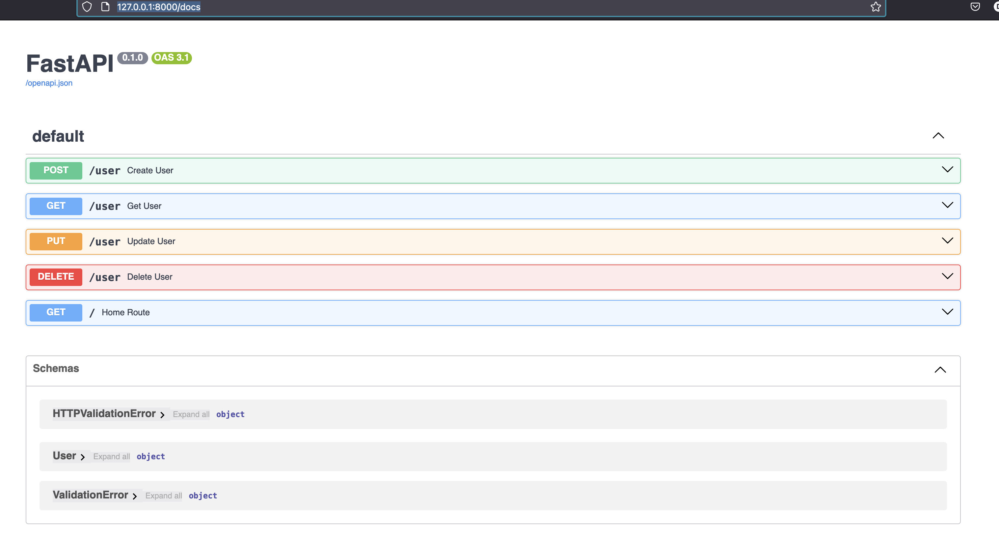
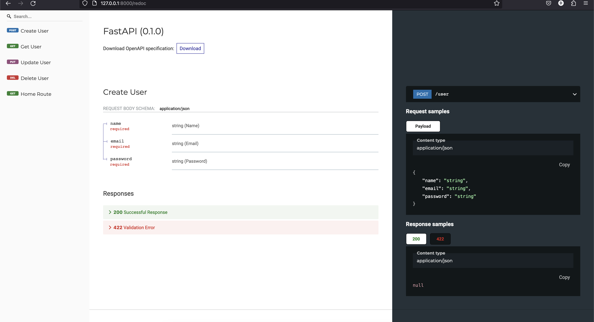
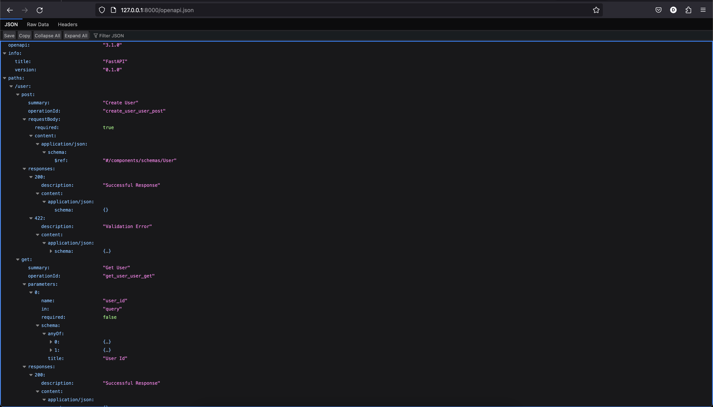

# Python FastAPI Framework CRUD application

This is a simple CRUD Restful API service that is built in Python and using the FASTAPI restful framework. This was developed in comparison to the Django and Flask Python frameworks to understand the nuances and differences in the frameworks and services. The interesting portion of this framework is that it is built upon the Open API standard in web development and the service builds the Swagger/Redoc information as part of the development process. 

## Getting Started

These instructions will get you a copy of the project up and running on your local machine for development. See deployment for notes on how to deploy the project on a live system.

### Prerequisites

What things you need to install the software and how to install them

```
Install Homebrew (optional)
Install of Python 3
Install Pip
Install PIPENV
Setup SUPABASE envionment
```

### Installing

Clone the repository 

```
git clone ....
```

Setup Supabase and get API and AuthKey. Supabase is used, and it is much like Firebase with the only difference bing it is based in PostGres rather than a NoSQL. Once you have created an account you will need to grab the API key and URL from the API menu. Then create a users Table which this service will connect too. 
```
https://supabase.com/
```

install the requirements from the pip file

```
pipenv install or pipenv install --dev
```

start the service

```
uvicorn app.main:app --reload 
```

As Fast API is built on top of the Open API spec, what makes this fascinating is the ability to get the Swagger documentation right from debugging in the local environment. Once the above command is run you can hit your local URL and add docs to the end in order to get the swagger documentation.

Swagger:
```
http://127.0.0.1:8000/docs
```


Redoc: 
```
http://127.0.0.1:8000/redoc
```



OpenApiSpec:

```
http://127.0.0.1:8000/openapi.json
```




## Built With

* [Python3](https://www.python.org/) - Programming Language used
* [FastAPI](https://fastapi.tiangolo.com/) - Web Framework used
* [SUPABASE](https://supabase.com/) - Database connection

## Authors

* **F. Derek Roman** - *Initial work* - [CodeNamor](https://github.com/CodeNamor)